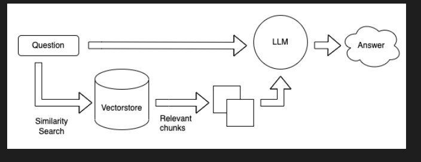

# RAG Application using Langchain and Bedrock

## Overview

This project implements a Retrieval-Augmented Generation (RAG) application using Langchain and Bedrock. The RAG model is designed for question answering tasks, leveraging retrieval-based methods for obtaining relevant data which can be websites, data in databases or pdfs etc and generation-based methods for generating responses. This application only uses data available on the website of Emumba Pvt Ltd as an example.

## Project Components

### 1. Dependencies

Make sure you have the required dependencies installed before running the application. The main dependencies include:
- langchain
- boto3
- numpy

You can install them using the following command:
```bash
pip3 install langchain boto3 numpy
```

### 2. Project Structure

The project structure is as follows:
- `utils`: Contains utility functions, including the `TokenCounterHandler`.
- `bedrock_rag.py`: The main script implementing the RAG application.

### 3. Running the Application

To run the RAG application, execute the `rag_application.py` script. Ensure that you have the necessary environment variables set, such as `BEDROCK_ASSUME_ROLE` and `AWS_DEFAULT_REGION`. The script loads a document from a specified website, processes it, and performs a question answering task.

```bash
python3 bedrock_rag.py
```

## Workflow

1. **Document Loading:**
   - The application loads a document from a specified website using various loaders, including `SeleniumURLLoader`.

2. **Text Processing:**
   - The document is processed and split into smaller tokens using a `CharacterTextSplitter`.

3. **Embeddings:**
   - The project uses the Titan Embeddings Model from Bedrock to generate embeddings for the documents.

4. **Vector Store Creation:**
   - FAISS is used to create a vector store from the generated embeddings.

5. **Question Answering:**
   - A user query is embedded, and similarity search is performed to find relevant documents.
   - The RAG model, comprising the Anthropic Model and Titan Embeddings Model, is used for question answering.

6. **Output:**
   - The application prints the answer to the user's query.

## Flow Diagram



The flow diagram (`ragflow.png`) illustrates the sequence of steps involved in the RAG application, from document loading to generating answers.

## Configuration

Ensure that you have the necessary environment variables set for Bedrock, including `BEDROCK_ASSUME_ROLE` and `AWS_DEFAULT_REGION`. Adjust the `website` variable in the script to specify the URL of the website from which the document will be loaded.

## Note

- The project assumes you have the required permissions and access to Bedrock services.
- Modify the script according to your specific use case or requirements.
